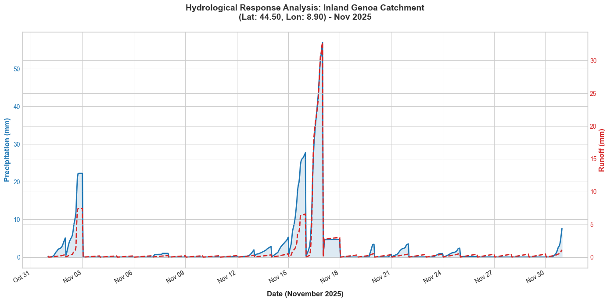

# Hydrological Response Analysis: Inland Genoa Catchment 🌧️

## Overview
This project analyzes the hydrological response of Genoa, a coastal city with steep terrain highly vulnerable to flash floods. By processing climate data, the project visualizes the relationship between precipitation and surface runoff to highlight the catchment's Time of Concentration.

## Data Source
- **Provider:** Copernicus Climate Data Store (ERA5-Land)
- **Variables:** Hourly Total Precipitation (`tp`) and Surface Runoff (`ro`)
- **Location:** Inland Genoa, Italy (Lat: 44.50, Lon: 8.90)
- **Timeframe:** November 2025

## Tools & Libraries Used
- `Python 3`
- `xarray` & `pandas` (for data extraction and wrangling)
- `matplotlib` (for dual-axis data visualization)

## Results
The dual-axis hydrograph demonstrates a rapid hydrological response. During the major storm event (Nov 16-18), a precipitation peak of ~55mm resulted in an immediate surface runoff spike of ~30mm. The remarkably short lag time visualizes the high risk of flash floods in this steep catchment area.

